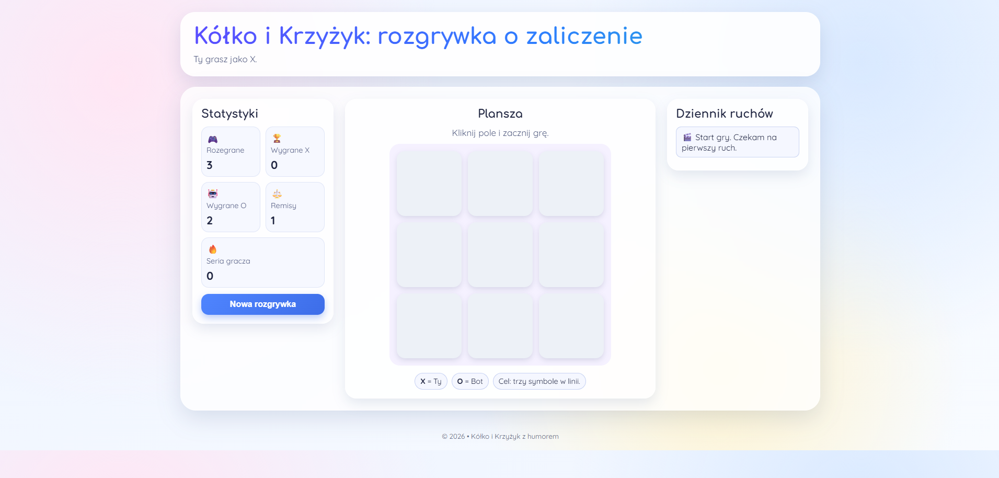
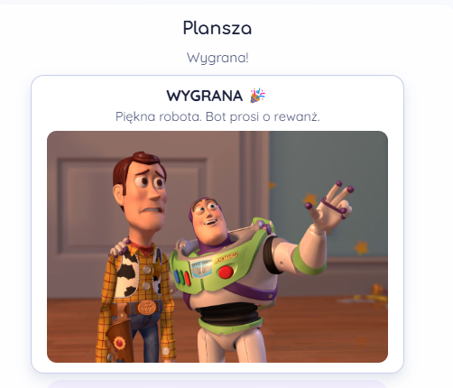
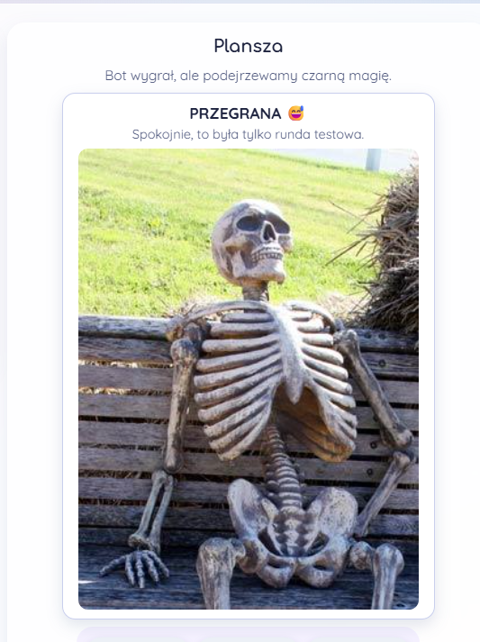
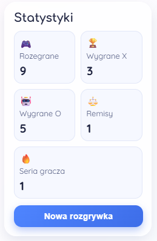
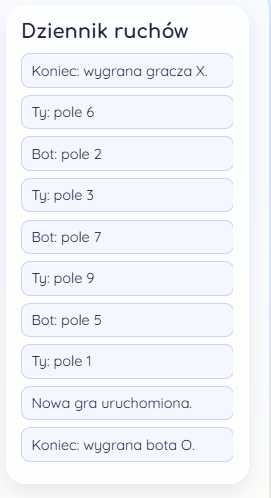

# Tic-Tac-Toe With a Bot

A small web-based tic-tac-toe game built for fun with Python and Flask.
The player uses `X`, while a simple bot responds with `O`.

## Features

- play tic-tac-toe directly in the browser,
- handle player and bot moves through simple API endpoints,
- show the round result with a random meme image,
- track basic in-memory stats for the current server session: games played, wins, draws, and player streak.

## Screenshots



| Win result | Loss result |
| --- | --- |
|  |  |

| Stats panel | Move log |
| --- | --- |
|  |  |

## Tech Stack

- Python
- Flask
- HTML, CSS, and JavaScript

## How to Run

1. Open the project folder.
2. Install dependencies:
   ```bash
   pip install -r requirements.txt
   ```
3. Start the app:
   ```bash
   python app.py
   ```
4. Open it in your browser:
   ```text
   http://127.0.0.1:5000
   ```

You can enable debug mode locally by setting `FLASK_DEBUG=1` before starting the app.

## Notes

Stats are stored in process memory, so they reset when the server restarts.
